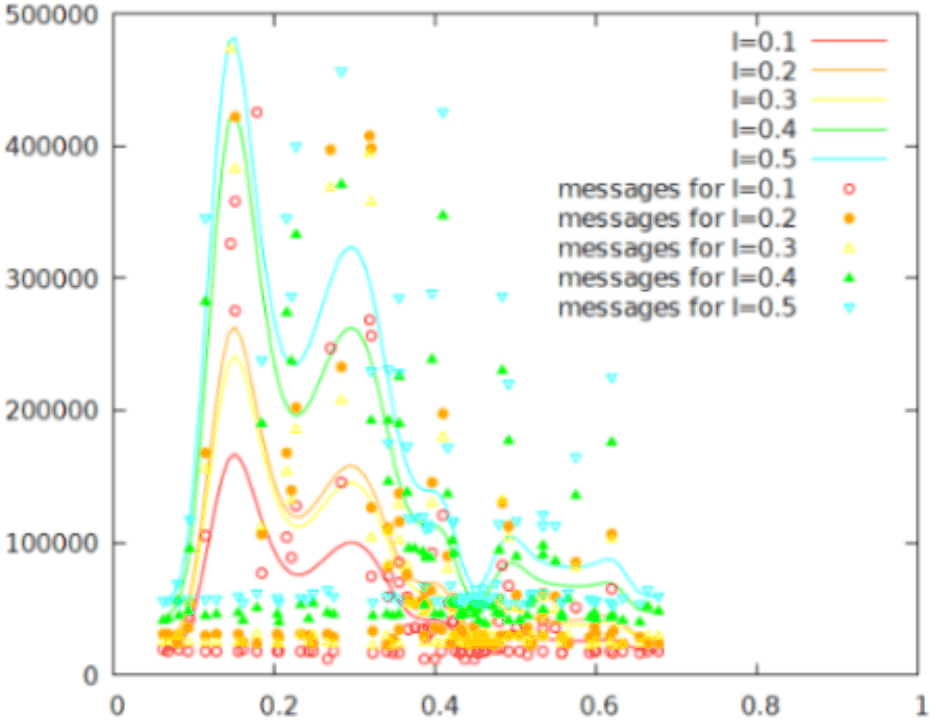

# Distributed Network
Distributed Network Simulation using omnet++

##  Purpose
 The purpose of the project was to show the difference in how the packets travelled from node to node depending on the change of the numbers of neighbours.
 Using a flooding algorithm in randomly generated nodes we elected a "leader" node based on which was the one with most neighbours and we tracked the traffic through each node.
 Each time we changed the distance were a node should be connected with another, a metric we a called rc.
 That we show that ,as you see below the less neighbours there the more traffic there is in the nodes closest to the "leader" node
 

 For more detail see the file distributed_report.pdf(greek) 
